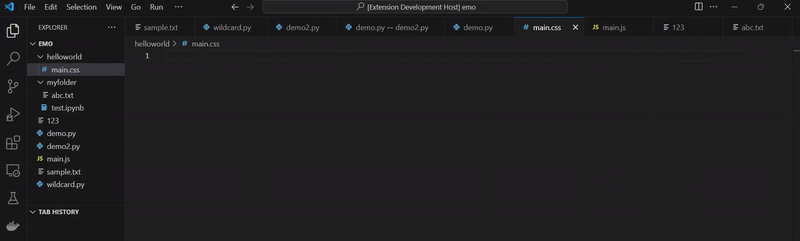
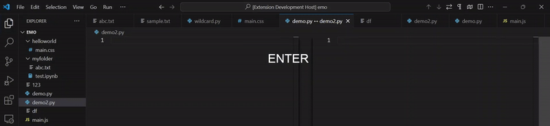
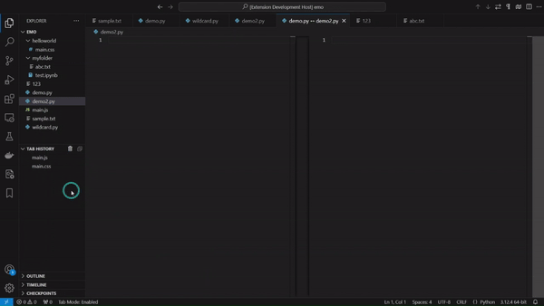

# Tabby - Tab Management and Filtering Extension

Lost in the ocean of your opened tabs, no worries **Tabby** is there to help you out.
**Tabby** is designed to help you efficiently manage, close and restore tabs with Vim-inspired shortcuts and custom filtering options. 

## Features

### 1. **Tab Mode**
   
   - Press `F10` to activate **Tab Mode**.
   - While in Tab Mode, you can quickly perform actions on tabs using single key shortcuts.

#### **Tab Navigation and Management Shortcuts**
   - `w` — Close the active tab.
   - `c` — Close all tabs in the active tab group.
   - `j` — Go to the previous tab.
   - `k` — Go to the next tab.
   - `a` — Move the current tab to the left.
   - `d` — Move the current tab to the right.
   - Numbers `1-9` — Quickly switch to the tab at the corresponding index.

### 2. **Filtering Tabs**
   
   - Press `f` while in Tab Mode or run command `> Tabby: Filter Tabs in Active Tab Group` to filter tabs in the active tabgroup. Enter a pattern into the prompt to keep tabs matching the pattern open and close the rest.

  - **Wildcard Patterns**:
     - `*` matches any sequence of characters.
     - `_` matches exactly one character.

   - **Path-Based Filter**:
     - Starts with `?` (e.g., `?myfolder`) — retains tabs whose file paths match the specified absolute or relative path based on the current project root.

   - **Index-Based Filters**:
     - **Single Index**: `1` — keeps only the tab at index 1 (the first tab) open.
     - **Range**: `3:5` — keeps tabs from index 3 to 5 (inclusive) open.
     - **Start Range**: `3:` — keeps tabs from index 3 to the last tab open.
     - **End Range**: `:4` — keeps tabs from the first up to index 4 open.

   - **File Name containing only Numbers**: 
     - Starts with `\` (e.g., `\123`) — matches tabs with the exact filename '123'.
   
   - **Combined Filters**: You can input multiple filters separated by commas. For example:
     ```
     *.py, 1:4, \123, ?myfolder
     ```
     This would keep open all tabs that:
     - Match the `.py` file extension or
     - Are within the index range 1:4 or
     - Match the file name `123` or
     - Reside within the folder `myfolder` in project root

### 3. **Tab History**
  
   - Quickly access recently closed tabs from the "Tab History".
   - Press `h` in Tab Mode or run command `> Tabby: Open Tabs from History` to quickly restore closed tabs based on the patterns described above.
   - Press `u` in Tab Mode to undo restore tabs closed recently (works only for tabs closed/filtered using Tabby).


